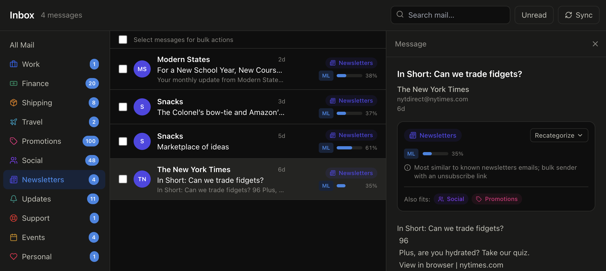
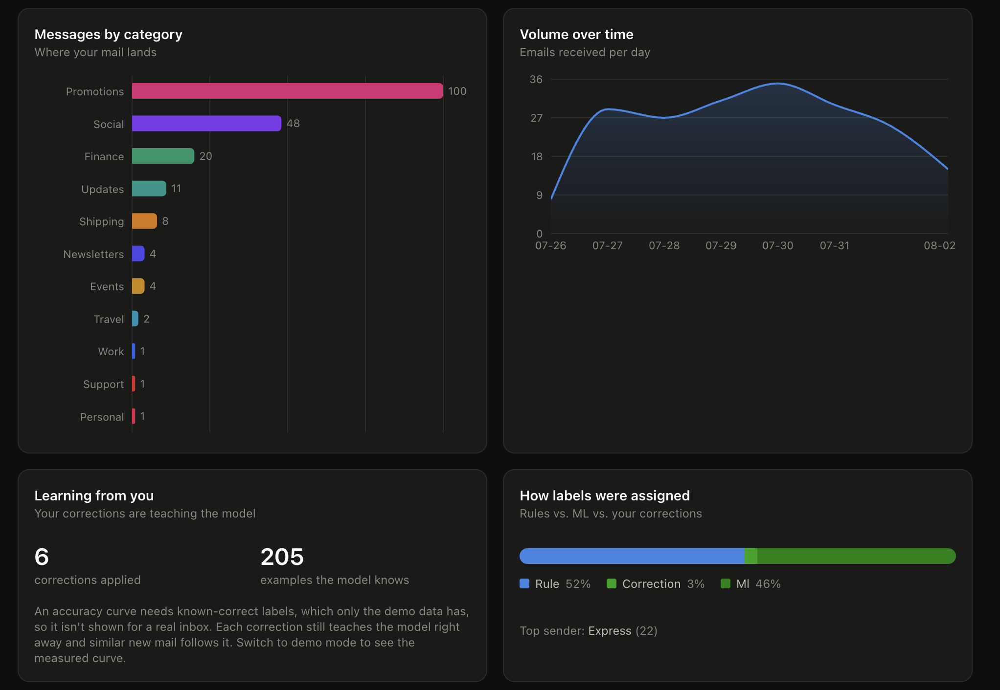
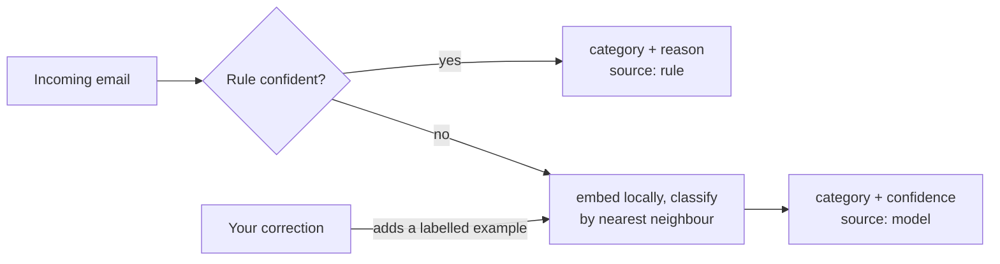

# Inbox Intelligence

A privacy-aware email intelligence platform. Connect your Gmail and it sorts your
real inbox into categories using a mix of hand-written rules and a local embedding
model, learns from your corrections, runs bulk actions and simple automation
workflows, and shows you what your inbox actually looks like.

<p>
  
  
  
  
  
  
  
</p>

A real Gmail inbox, sorted:



The insights dashboard:



<!-- Drop your screenshots at docs/screenshots/inbox.png and docs/screenshots/insights.png -->

## Connect it to your Gmail

Point it at your real inbox in four steps (there is also a Settings page in the app
that walks through this):

1. Turn on **2-Step Verification** (Google account, then Security).
2. Create a **Gmail app password** (Google account, Security, App passwords, pick
   "Mail") and copy the 16-character code.
3. Put it in `backend/.env`:

   ```
   DEMO_MODE=false
   GMAIL_ADDRESS=you@gmail.com
   GMAIL_APP_PASSWORD=xxxx xxxx xxxx xxxx
   ```

4. Restart `make api`. It pulls your inbox on startup; the **Sync** button refetches
   any time.

The connection is **read-only** over IMAP: it reads headers and bodies and never
deletes, moves, or marks anything. It uses an app password (revocable, scoped), not
your real password. Categorization runs locally, so **no email content leaves your
machine**. Prefer not to connect a real inbox? Leave `DEMO_MODE=true` and it runs on
a few hundred realistic synthetic emails instead. Full data-handling notes:
[docs/PRIVACY.md](docs/PRIVACY.md).

## How does it work?

Two stages, run in order:

1. **Rules.** Cheap, precise checks first: known sender domains (ups.com is
   shipping, chase.com is finance), a `List-Unsubscribe` header, calendar
   attachments, obvious spam phrasing. When a rule is confident it wins, and the UI
   shows the reason ("from ups.com, a known shipping sender").
2. **A local embedding model.** Anything the rules are unsure about gets embedded
   and classified by nearest-neighbour against labelled examples. The default model
   is `sentence-transformers/all-MiniLM-L6-v2`, run locally on CPU. If that package
   is not installed, the app falls back to a small dependency-free hashing embedder
   so it still works on first run with no download.

Either way the text never leaves your machine. Nothing is sent to an outside API.



## Why nearest-neighbour instead of a trained classifier

Because a correction should take effect immediately. With nearest-neighbour, a
correction is just one more labelled vector, so the next prediction already
reflects it with no retraining step. That is what makes the "it learns from you"
part feel live instead of aspirational.

## Measured accuracy

`make bench` scores the categorizer against a held-out synthetic set and writes
[docs/RESULTS.md](docs/RESULTS.md). It's **single-label** classification over
**12 categories**, reported as the **mean across 5 held-out seeds**, using the local
MiniLM model:

| Approach | Accuracy |
|---|---:|
| Rules only | 72% |
| Model only | 91% |
| **Rules + model (hybrid)** | **92%** |

The hybrid edges the model alone because the precise rules correctly catch a few
cases the model scatters (an unambiguous "mentioned you" is social, a known bank is
finance), while the model handles everything the rules are unsure about.

Two things worth knowing before quoting these:

- **Real-inbox validation.** The table above is a synthetic benchmark; on one real Gmail
  inbox, held-out accuracy rose from **75% to 81%** after a handful of corrections (72
  hand-labeled emails). One inbox, so it's an estimate rather than a reproducible number,
  but it's measured on a frozen set the model was never taught, so the gain is real
  learning, not memorization.
- **The number depends on the embedder.** These are with MiniLM (`make install-ml`).
  The zero-dependency fallback embedder scores a little differently on this synthetic
  set; `RESULTS.md` records which embedder produced its numbers.

## Evaluating on real data

The synthetic benchmark scores against known-correct labels, which a real inbox does
not have. To get an honest real-world read, `make eval` samples your actual inbox, you
hand-label the correct category for each, and it reports held-out accuracy (overall,
model-only, per-category, with a rough confidence margin). Because it excludes any
email you later correct, you can measure a genuine **before/after**: label a fixed
sample, note the baseline, teach the model a handful of corrections, re-sort, then
`make eval-score` re-measures the *same* held-out set. No email content is written to
any tracked file. (One real-inbox run of this is in [Measured accuracy](#measured-accuracy)
above.)

## Features

- Categorization into 12 categories, each labelled with a source (rule, model, or
  your own correction), a confidence, and a plain-English reason.
- Correct any email's category. It updates the model right away and the change is
  tracked, so the Insights page can plot accuracy over time.
- Bulk actions (archive, mark read, delete, relabel) that preview before they run.
- Simple automation rules: when a message matches a condition, do something to it.
- An insights dashboard: category breakdown, volume over time, the learning curve,
  and how labels were assigned.

## Architecture

```
inbox-intelligence/
  backend/          FastAPI, SQLAlchemy, local ML
    app/
      api/          HTTP routes
      services/     use-case orchestration
      core/         pure logic: categorization, learning, automation, insights
      repositories/ database access
      ingest/       synthetic generator and optional Gmail source
      models/       ORM models
  frontend/         Next.js 15, TypeScript, Tailwind, Recharts
```

The layers only depend inward: routes call services, services call core and
repositories, and the core categorization code has no framework or database
imports, so it is easy to test on its own. More detail in
[docs/ARCHITECTURE.md](docs/ARCHITECTURE.md).

## Running it

You need Python 3.13 and Node 22.

```bash
make install     # backend venv and deps, plus frontend npm install
make seed        # generate the synthetic demo inbox
make api          # backend on :8000 (API docs at /docs)
make web          # frontend on :3000
```

Open http://localhost:3000. No accounts, no keys.

The base install stays light on purpose: it runs on a zero-dependency hashing
embedder so a fresh clone works in seconds with no large download, and CI stays
fast. The app automatically uses the real transformer when it's installed, so to
switch to **local MiniLM embeddings** (recommended for a real inbox, where it
generalizes much better) just run:

```bash
make install-ml     # adds PyTorch + sentence-transformers (~1.5GB), then restart the API
```

Other tasks:

```bash
make test    # backend tests
make lint    # ruff and mypy
make bench   # regenerate docs/RESULTS.md
```

See [Connect it to your Gmail](#connect-it-to-your-gmail) above for the setup steps.
The app-password path is meant for running against your own inbox; letting arbitrary
visitors connect their Gmail on a public deployment would need Google OAuth with
verified scopes, which is out of scope here.

## Stack

Backend: FastAPI, SQLAlchemy 2.0, Alembic, Pydantic v2, sentence-transformers,
pytest, ruff, mypy.
Frontend: Next.js 15, React 19, TypeScript, Tailwind, TanStack Query, Recharts.

## License

MIT. See [LICENSE](LICENSE).
