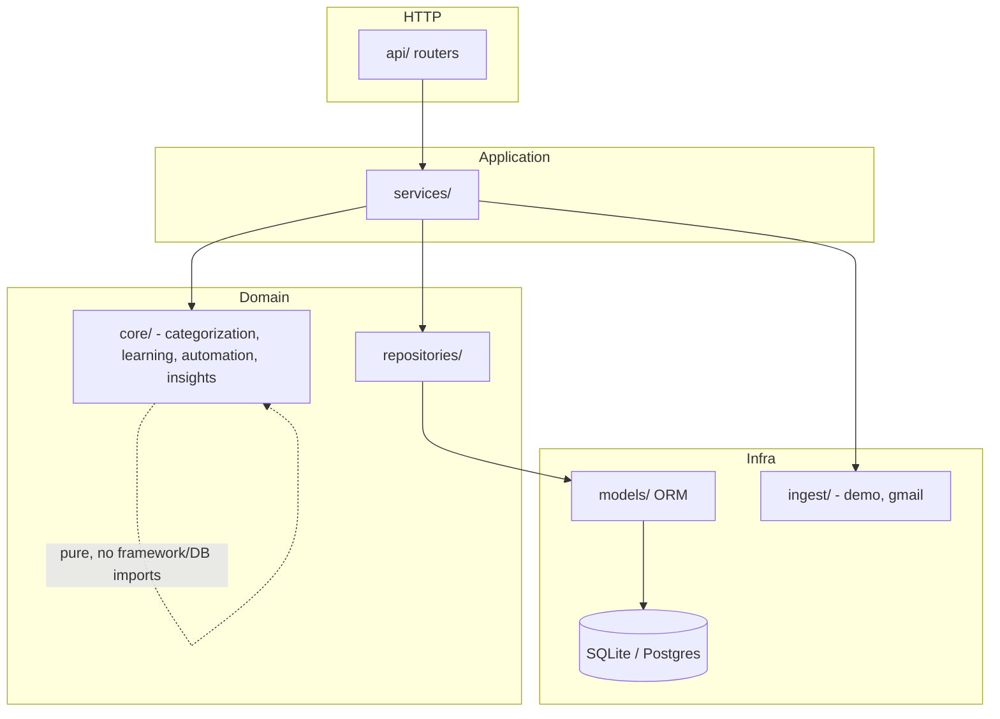
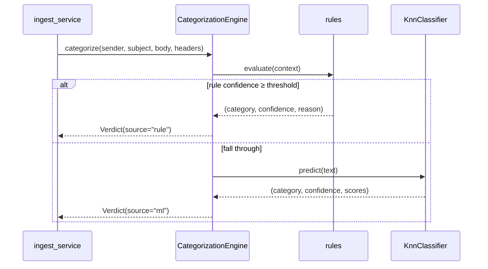
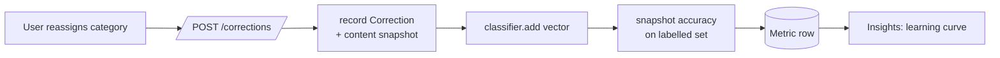

# Architecture

## Layering

The backend is organized in strict layers; dependencies point inward only.

**Rules of the layering**

- `api/` handles HTTP only - validation, status codes, dependency injection. No business logic.
- `services/` orchestrates use cases (e.g. *ingest → categorize → persist*, *apply correction →
  update model → snapshot accuracy*). This is the only layer that touches both `core` and
  `repositories`.
- `core/` is pure domain logic with **no FastAPI and no DB imports**. The categorization engine,
  classifier, rules, automation matcher and insight heuristics are all unit-testable in isolation.
- `repositories/` is the only place that writes SQLAlchemy queries.
- `ingest/` implements the `EmailSource` protocol - `DemoSource` (synthetic) and `GmailSource`
  (optional, read-only) are interchangeable.

## The categorization engine

- **Engine** (`core/categorization/engine.py`) - orchestrates rules → ML, emits a `Verdict` with
  `category`, `confidence`, `source`, `reason`, `scores`.
- **Rules** (`rules.py`) - high-precision heuristics (known sender domains, `List-Unsubscribe`,
  calendar invites, spam phrasing, account-notice keywords). Each returns its own `reason`.
- **Embeddings** (`embeddings.py`) - local `sentence-transformers` MiniLM with a **deterministic
  hashing fallback** (numpy only) so the system runs, and CI passes, without downloading torch.
- **Classifier** (`classifier.py`) - kNN + centroid vote over L2-normalized embeddings. Adding a
  correction is `O(1)` (append one vector), which is what makes online learning trivial.

## The learning loop

Corrections are both audit records and training examples. On startup the engine is rebuilt from
built-in prototypes **plus every stored correction**, so it always reflects what the user taught it.

## Data model

| Table | Purpose |
|---|---|
| `emails` | one row per message; carries the categorization result + `true_category` (benchmark only) |
| `corrections` | user relabels - audit trail and training examples |
| `automations` | IFTTT-style rules stored as JSON (`condition` / `action`) |
| `metrics` | accuracy snapshots that power the learning curve |

Categories are **not** a table - they're a fixed code-level taxonomy
(`core/categorization/taxonomy.py`), the single source of truth shared by rules, ML, API, and UI.

## Frontend

Next.js App Router with three routes - **Inbox**, **Insights**, **Automations**. Server state is
managed by TanStack Query against a thin typed client (`lib/api.ts`); `/api/*` is rewritten to the
FastAPI backend so the browser sees one origin. Charts use Recharts with a validated,
accessibility-checked palette that is theme-aware (light/dark).
