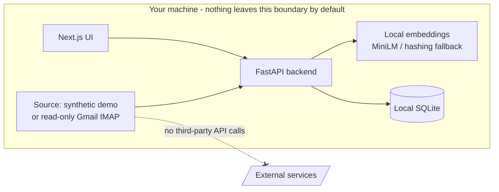

# Privacy & Threat Model

Inbox Intelligence is designed so that **email content never has to leave your machine**. This
document states what the system does with data, and what it deliberately does not do.

## Data flow

## Principles

1. **Demo-first.** `DEMO_MODE=true` is the default. The app runs entirely on seeded synthetic mail,
   so it can be demoed publicly without exposing any real inbox.
2. **Local processing.** Categorization runs locally - deterministic rules plus a local embedding
   model (or a pure-numpy hashing fallback). **No email content is sent to any external API.**
3. **Read-only real access.** The optional Gmail source connects over IMAP with
   `readonly=True`; it fetches headers and body but **never deletes, moves, or flags** mail.
4. **Least-privilege credentials.** Gmail access uses a **App Password** (Google Account →
   Security → App passwords) - revocable and scope-limited - never your primary password or OAuth
   with broad scopes.
5. **Nothing secret in git.** `.env`, all `*.db` files, real exported mail, and model caches are
   gitignored. Only synthetic fixtures are committed.

## What is stored, and where

| Data | Location | Committed to git? |
|---|---|---|
| Emails (synthetic or fetched) | local SQLite (`backend/data/*.db`) | No - gitignored |
| Corrections / automations / metrics | same local SQLite | No - |
| Gmail credentials | `backend/.env` (env vars) | No - |
| Embedding model weights | local HF cache | No - |
| Synthetic templates | `app/ingest/demo.py` | Yes, fake data |

## Threats considered

| Threat | Mitigation |
|---|---|
| Accidentally committing real mail | `*.db`, `emails/`, `.env` gitignored; demo data is the only committed corpus |
| Credential leakage | App Password (revocable), read from env only, never logged |
| Content exfiltration to a model provider | No external inference - embeddings are local; hashing fallback needs no model at all |
| Destructive action on a real inbox | Gmail source is strictly read-only; bulk actions default to dry-run |

## Out of scope (honest limitations)

- No authentication/multi-tenant isolation - it's a single-user local tool, not a hosted service.
- The demo DB is unencrypted at rest (local file). For real use, rely on OS disk encryption.
- Deploying with `DEMO_MODE=false` to a shared host would send mail to that host - keep real-inbox
  use local.
